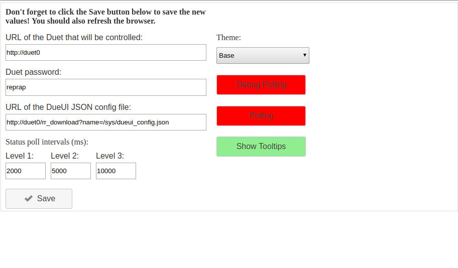

# Welcome to DueUI

This is a lightweight user interface for the Duet family of 3D printing
electronics.  For more information on the Duet products, visit
http://duet3d.com and the forums at http://forum.duet3d.com.

Sample Main Screen:

 

**Don't like this layout?  KEEP READING!** 

This user interface is not meant to replace the full fledged
[DuetWebControl (DWC)](https://github.com/chrishamm/DuetWebControl)
interface but rather to complement it.  I needed something more
compact, kind of like the PanelDue user interface and had started
looking at ways to make the PanelDue more user-customizable.
While the PanelDue is great at what it does though, trying to develop
a framework that would let it be more customizable without recompiling
the firmware every time just wasn't feasable.  It then dawned on me 
that 7" Android tablets with serviceable browsers were ridiculously cheap
so I started down the road of creating a custmizable widget based
user interface that could run on any modern browser:  The DueUI.

## Quick Start

*  Download the latest DueUI zip file from https://github.com/gtjoseph/DueUI/releases
*  Upload the zip file to your Duet using Duet Web Control (DWC), Settings, Upload Files.
*  Point your browser at http://<your_duet>/dueui.html
*  If this is the first time you've tried this, you should get the settings
panel:

 

The URLs should be prefilled with the URL you used to get to your Duet.
The "reprap" password is the default if you have no password set.

* Click the "Polling" button to enable polling.
* Refresh your browser page.

If you're using a tablet running Android 5.1 (Lollipop) or better, or an
Amazon Fire tablet 7th generation or better, try the DueUI app! You'll have to
set "Allow Apps from Unknown Sources" in Settings, Security before
installing.  Then you should just be able to browse to the APK file
in [Releases](https://github.com/gtjoseph/DueUI/releases) and click it.

### Installation Notes:

DueUI uses the [jQuery](https://jquery.com) Framework, the
[jQuery-UI](https://jqueryui.com) User Interface Framework
and the [js-cookie](https://github.com/js-cookie/js-cookie)
library.  Those libraries are retrieved by your browser from
public content delivery networks instead of the Duet itself
to help save processing and network resources on the Duet.
If the browser you're going to use to access DueUI doesn't,
or won't have access to the Internet, it won't work.  If you
need this capability, let me know by filing an issue.  I can
create an alternate zip file that has the jQuery and js-cookie
libraries embedded in it but I'd have to make sure it doesn't
interfere with the DWC which also uses the jQuery libraries.

If you find yourself in trouble and need to start over, simply
delete the "dueui_settings" cookie from your browser and refresh.
You'll be taken back to the initial settings screen.

### Alternate Installation

You don't *have* to install DueUI on your Duet.  You can install
it anywhere it can be served by a standard web server.  A
Raspberry Pi for instance.  There's even a neat little
Chrome app that acts as a web server:
[Web Server for Chrome](https://chrome.google.com/webstore/detail/web-server-for-chrome/ofhbbkphhbklhfoeikjpcbhemlocgigb)
(no affiliation on my part).

Just unzip the DueUI zip file to the folder of your choice,
point your web server at that, then point your browser at *that*.
 
When you get to the DueUI settings page, just correct the Duet and
config file URLs.

Actually, your `dueui_config.json` file doesn't even have to be
on the same web server as the DueUI itself or on the Duet.  It
doesn't even have to be named `dueui_config.json`.  The only
restriction is that you can't use "file://" URLs because of
browser Cross Origin security restrictions. 
  
## Customization

When DueUI installs, it creates a default configuration file
at `/sys/dueui_config_default.json`.  If the default configuration
works perfectly for you, let me know.  I'll want to run out and buy
lottery tickets.  If not, well, the main goal of DueUI is to allow
you to customize the layout so it works for YOU.

Before you go any further... **Don't modify the
`/sys/dueui_config_default.json` file.**
It will be overwritten each time you upgrade DueUI.  Copy
the file to `/sys/dueui_config.json` and modify *that*.  DueUI
searches for config files in this order:
* The config file URL in DueUI Settings.
* /sys/dueui_config.json on your Duet.
* /sys/dueui_config_default.json on your Duet.
* /DueUI/dueui_config.json on the web server you're hosting DueUI on.
* /DueUI/dueui_config_default.json on the web server you're hosting DueUI on.
* dueui_config.json on the web server you're hosting DueUI on.
* dueui_config_default.json on the web server you're hosting DueUI on.

Seems like a lot of options but I wanted to give DueUI the best chance
of finding the config file I could.

I won't insult your intelligence by repeating the warning about modifying
the default config file.  If you complain that you lost 2 days of work
when you upgraded, I'm going to simply point you here. :)

Take some time now to familiarize yourself with the default config
file.  It's (hold on to your knickers) about 1700 lines but it's
heavily commented and includes things you don't actually need for
illustration purposes.

### A few notes about dimensions and position:

#### px's, em's and ch's Oh My!

You may notice that in the default config file I use multiple dimension
units.  I didn't invent them.  See https://www.w3schools.com/css/css_units.asp
for more info about what they mean.  You can use any of the standard
CSS dimension units in the widget "style" attributes.  

#### Global Positioning Stupidity

DueUI uses jQuery's "position" syntax to place widgets on the screen.
In principle this should have worked well:
Place `{"my": "left top", "at": "left bottom", "of": "#heater_labels"}`.
That works great with static elements defined in the HTML.  When you
create dynamic elements where their width and height may be dependent on
other dynamic elements, figuring out where something's "left" or "top" is
is easy but figuring out where "right" or "bottom" is becomes difficult.
The macro grids are a good example.  Add "border": "1px" to one of their
styles and you'll see that the grid's boundaries probably don't correspond
to the displayed buttons.  I've *tried* to make things match up as much
as possible but there will be times where "right" or "bottom" isn't where
you'd think it should be for a widget.  There are some things you can do
to compensate for that though...

* Don't use "right" or "bottom".  I know, it's like the doctor saying
"Don't do that" but if you stick to "left" and "top" and use offsets
you should be OK.   

* Speaking of offsets...  You can use offsets like "left+50" or "bottom-20"
to position elements.  Units are always pixels. You can't use other 
CSS units here.

* Use a common origin for all your widgets, like...
`{"my": "left top", "at": "left+150 top+200", "of": "#dueui_main_panel"}` for
one widget and `{"my": "left top", "at": "left+200 top+250", "of": "#dueui_main_panel"}`
for the next, etc.

### Theming

The settings panel has a dropdown for selecting a theme.  These are the
standard jQuery-UI themes found on their [ThemeRoller](https://jqueryui.com/themeroller/)
website.  I don't have a mechanism for uploading your own theme because
you can customize pretty much anything in the config file using the "style"
parameters.  I _do_ have some work to do making the classes assigned to widgets
a little more consistent.  If you decide to customize DueUI with your own style
sheet, better class names will help.  

### Basic Configuration   

The config file is a JSON object wrapped in a JSONP function.  Eh?
Most of us are familiar with JSON but if not, you'll pick it up
easily reading the default file.  JSONP is a technique for wrapping
a JSON object in a function call to get around Cross-Origin Resource
Sharing restrictions.  I'm not going into it any further other than to say
"Don't mess with the `DueUIConfig({` line at the top of the file".

The config file defines "elements".  They can be "panel"s, "button"s,
"textarea"s, "input_field"s, etc. or specialized combinations of those
things like a "heater" which is a panel containing 2 buttons and 2 input fields
or a "macro_grid" which is a panel containing buttons auto filled from
a folder on the Duet. The file is just a heirarchy of those elements.

The default top-level element is a "tabbed-panel" with a "header_panel",
"menubar" and a "panel_area".  YOU DON'T HAVE TO START WITH THIS WIDGET
IF YOU DON'T WANT.  It's where I started because it closely emulates
the layout of the PanelDue UI. Whatever you start with however, it
has to be an object named "dueui_content".

That's it.  Everything else you need to know is in dueui_config_default.json.

Take my advice, make backups of your changes and test in small iterations.
If you make a ton of changes without intermediate testing and you miss 1
comma, you'll be hating life while you're trying to track it down.

Another tool to help you test is the "Don't Send GCode" option in settings.
This will display the GCode in the DueUI console without actually sending
it to the Duet.  The GCode is always displayed in the browser's Javascript
console. 

## Known Issues

This isn't really an issue with DueUI but it got me.  The Kindle Fire
tablets don't resolve local network hostnames so even if you use Chrome
on a Fire Tablet instead of Silk, you'll need to use IP addresses instead
of hostnames.  The reason is that the Fire devices used Amazon's proxies
for all communication and only allow local access if it recognizes a
private IP address is being tried.

The file_grid widget is functional but ugly.  I'm trying to figure out a
better way to display and select files.

GCode replies for long running commands aren't being displayed.  If you have
a button that does bed levelling with G32 for instance, the results won't show
in DueUI.   

Heater configuration is ugly.  When I started DueUI, I submitted a [pull
request](https://github.com/dc42/RepRapFirmware/pull/254) to @dc42 to add a
new M308 Gcode command to RepRapFirmware that allows unambiguous and independent
control over any heater's state and set points as well as a
[pull request](https://github.com/dc42/RepRapFirmware/pull/255)
that adds two new arrays to the status messages that allow retrieval of a
heater's active and standby set points without having to know what type of
heater it was.  Unfortunately, neither of those 2 pull requests have been
merged yet.  This makes manipulating heaters a little tricky because without the
M308 command, only way to turn a heater off is to set it's temperature to
-273.15&deg;C.  I'm hoping those pull requests get merged shortly but in the
mean time, I've created an
[RRF release](https://github.com/gtjoseph/RepRapFirmware/releases/tag/2.03beta3-m308)
based on @dc42's 2.03beta3 that has
the pull requests merged in if you'd like to try it.  With it, you can
eliminate half of the configuration of each heater.  

## Browser Compatibility

I've tested on the latest versions of Chrome Desktop and Mobile, Firefox
Desktop, Vivaldi and Silk Mobile.  Firefix did render the input fields
in the heater widgets a little differently but I saw no other issues.  

## Troubleshooting

If you run into trouble, the first thing to do is turn your computer off and
back on again because that _always_ helps. :)

When you try DueUI for the first time or are making changes to your
config, you should do this from a desktop browser.  The reasons are twofold:
It's easier to clear the "dueui_settings" cookie in a desktop browser, and
you can right-click and select "Inspect" from the popup menu.  This opens
the browser's Javascript console and can give you (and me) more info to help
figure out what's going on.

Were you shown the settings panel the first time you accessed DueUI?
The Settings screen automatically comes up if "Polling" is disabled,
which it will be on first access.  If you're not getting that far,
check your URL and that your Duet is where you think it is network-wise.
If you're still having problems even getting this far, disconnect
the DWC from the Duet and try from the same browser.  The Duet has limited
resources to serve network clients so it may have run out.  I haven't had
any problems running 1 DWC and 1 DueUI session at the same time but I have
had problems when I've inadvertently left DueUI sessions going on 2 tablets
then tried a third from my desktop, which already had DWC running.

If you keep getting the settings screen after refreshing, you probably forgot
to click the "Polling" button.  I did fail accessibility guidelines here by
making the background colors on those buttons red and green with no way to
change them and no other visual cue as to their status.  I'll get to it. 

OK... You saved settings but you now get a blank screen after the refresh?
This is almost ALWAYS caused by DueUI not being able to find the config
file, or it being so badly mangled that it won't load at all.  The best way
to tell what's going on is to right click, select "Inspect", then select the
"Console" tab.  If you see "404" errors that means that DueUI wasn't able to
find the config file you entered in settings.  It should have picked up
the default though so you might have to nose around a bit to see what the
issue might be.  If you need to get back to the settings screen, just delete
the "dueui_settings" cookie and refresh.

If you've got everything up and running but you start seeing messages
about failed polls, it's probably the Duet running out of
network resources.  Disconnect any other network clients and refresh. 

If all else fails, hit me up in the DueUI post on the Duet Forums.     

## Feedback

The entire point of this project was to create something that can be customized
by users.  **If there's something I can do to make that a better experience,
let me know!**  File an issue here or speak up on the [Duet Forums](https://forum.duet3d.com).
I do have a day job ([Asterisk](https://github.com/asterisk/asterisk)) that I love
but I will always have time for this project.

## Contributions

I'm always open to help.  My day job is as a core developer on a pretty active
open-source project so I'm used to working with community contributors.  The
code base isn't complex at all.  There's 1 base class all other components are
based on: DueuiElement.  From there, it's either a DueuiPanel or a DueuiWidget. 
There's still some refactoring work I need to do.  Like all projects, things
done at the start of the project don't always get updated as new things get
added and new techniques get tried. :)  I think I've refactored DueuiButton
about 50 times now.  In the mean time, if there are things that you think
could have been done better, tell me about it or send a pull request. 
